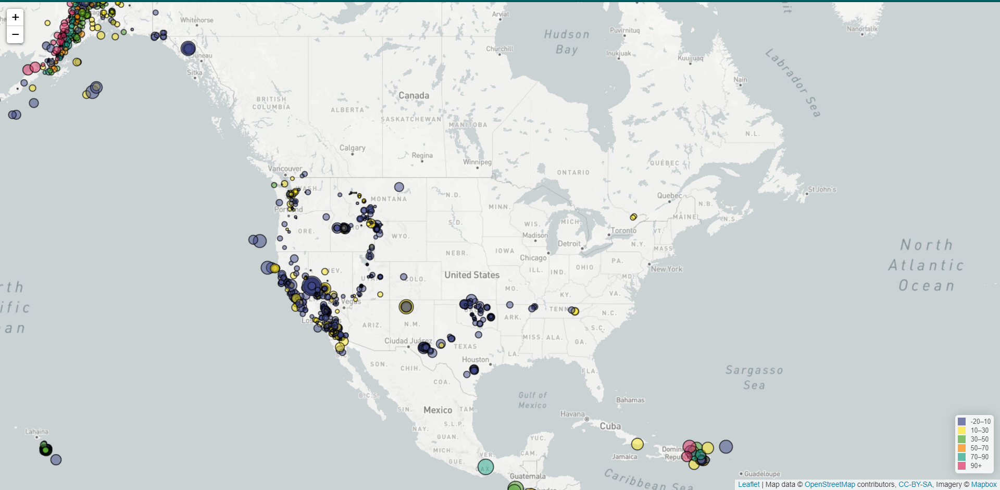

# leaflet-challenge
Challenge:
The challenge was to use leaflet.js to visualize earthquakes across the world.

Data:
The map of earthquake sites was based on data from the US Geological Survey site below:
http://earthquake.usgs.gov/earthquakes/feed/v1.0/geojson.php

The data included earthquake information such as latitude and longitude coordinates, depth of earthquake, magnitude of earthquake and text location over the last seven days(as of 7/14/21).  The data was presented in a geoJSON format.

Code:
Initial code included setting up a map using leaflet and importing the tile layers for the map.  Then a data connection to the API was established using D3.JSON.  After connecting to the data, the latitude and longitude coordinates were gathered to mark the earthquake locations.

Using leaflet geoJSON, a map layer was created to show locations with a circle marker.  The marker size is determined by the earthquake magnitude.  This was done by adjusting the radius of each circle to correspond with the earthquake magnitude in each location.

Marker colors were also added by assigning colors to each marker based on a locations earthquake depth.

Next, popups were added to each marker showing the earthquake location, depth and magnitude.  The popups are visible by clicking on a marker.

The final piece of the code is to add the legend of colors for each depth scale.  This was added to the bottom right of the map.

The data pulled for this challenge showed relatively small size and depth throughout the United States as compared to other parts of the world, particularly South America's west coast.  The glaring exception to that is Alaska, which has more activity and variety of depth than even the well-know earthquake centric California.

Take a look at the earthquakes from this past week (from 7/14/21).
